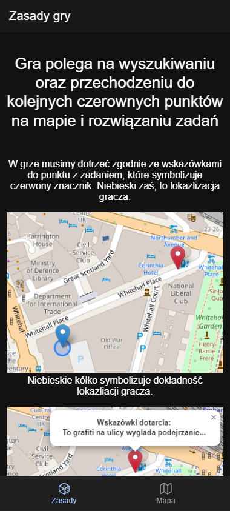
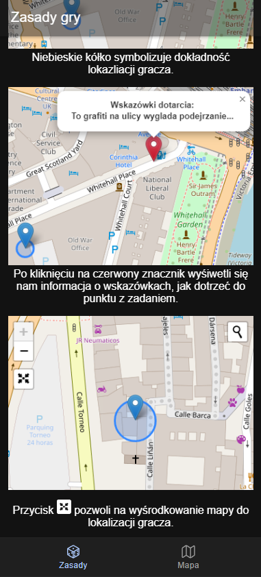
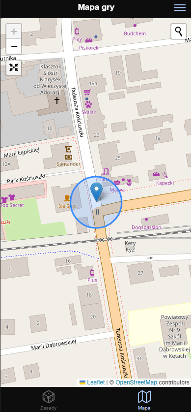
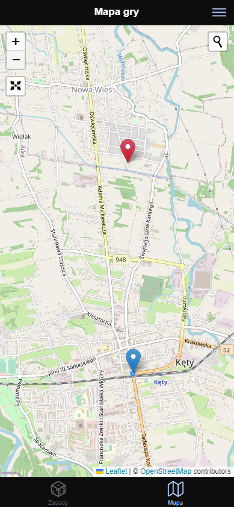
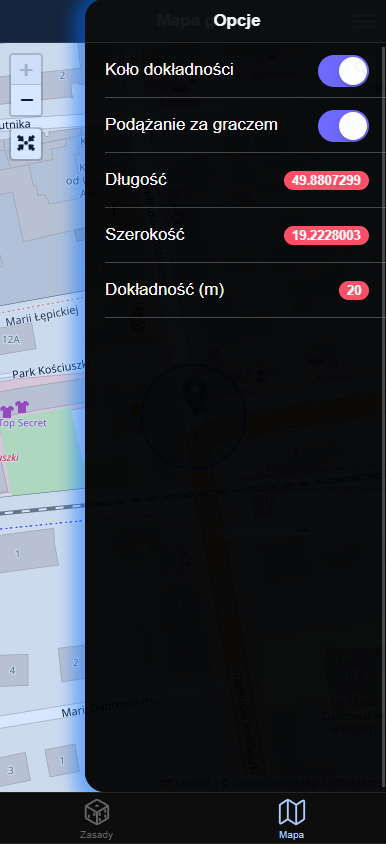

# Hare and Hounds Android Game

The application is a new incarnation of the classic game of Hare and Hounds or Chalk Chase. It contains tasks to be completed, reaching the destination after clues distributed around the game area. The game includes general rules of the game on the start page, providing a complete guide to the app. The game's home page is a map. And that's it!

## Technology
The application was built using the popular Ionic framework and Angular. The map feature is provided by openstreet lefalet. The application was tested using google pixel emulators in andorid studio and a physical xiomi remi note 8 pro device.
